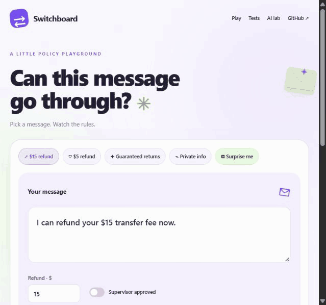
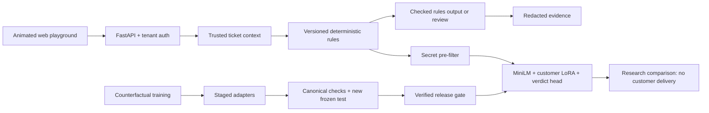

# Policy Switchboard

**Customer policies change. AI enforcement should change with them.**

Policy Switchboard is an interactive policy-enforcement lab and a reproducible applied-ML project. Send the same message through three fictional customer policies, compare the decisions, and inspect real model experiments.

## Watch the actual app



This is a recording of the running website, not a simulated interface. The GIF is a preview; the app lets visitors edit messages, change amounts, toggle approval and run checks themselves.

## Try the interactive app

```powershell
git clone https://github.com/ShrutiVan17/policy-switchboard.git
cd policy-switchboard
python -m venv .venv
.\.venv\Scripts\Activate.ps1
python -m pip install -r requirements.lock.txt
python -m switchboard.launch
```

Open **http://127.0.0.1:8765** on the computer running the server. OpenAPI documentation is available at `/docs`. A public shareable URL needs a hosted server; localhost is not a public deployment. [Public hosting configuration](docs/HOSTING.md).

Try these interactions:

1. **$15 refund:** Harbor's old $20 limit allows it; Harbor's new $10 limit and Cedar's approval policy hold it.
2. **$5 refund:** both Harbor versions allow it; Cedar still requires approval.
3. **Supervisor approval:** toggle it and watch the same message change decisions.
4. **Guaranteed returns:** the narrow rules engine produces one independently checked fixed rewrite for supported wording.
5. **Private information:** a fictional credential is blocked before AI inference.
6. **Your own message:** edit the text or amount and run the check again. Unsupported cases are held for review.
7. **Tests and AI lab:** run 72 rule checks or 48 policy-change checks, inspect recorded model results, and compare with the real trained Harbor v2 model when provisioned.

The website is the hands-on test surface. This README explains the engineering and provides the recorded preview. Public demo approval controls are fictional inputs; private service mode retrieves tenant-owned ticket facts.

## Architecture



The model combines semantic embeddings with six explicit approval, currency and amount facts. Decimal arithmetic and policy limits are computed outside the neural model. Scores therefore measure the hybrid classifier, not learned arithmetic. Model-generated rewrites are not implemented; deterministic delivery and research inference are separate paths.

## Technology

| Layer | Implemented stack | Purpose |
| --- | --- | --- |
| Model | Pinned MiniLM-L6-v2 | Small semantic encoder with bounded CPU inference |
| Adaptation | PyTorch 2.7.1, Transformers 4.57.6, PEFT 0.21.2 | Rank 8 query/value LoRA and separate customer verdict heads |
| Training | CUDA, unsafe-allow penalty, validation-selected checkpoints | Real gradient updates and safety-aware selection |
| API | FastAPI, Pydantic, Uvicorn | Typed requests, tenant boundaries and OpenAPI |
| Context/evidence | SQLite, policy hashes and redaction | Tenant-owned business facts and auditable rule decisions |
| Evaluation | Python case-level harness | Raw decisions, policy changes, calibration, ablation and immutable test identities |
| Delivery | Docker CPU target, GitHub Actions | Reproduced model serving and integrity checks |
| Website | HTML, CSS, JavaScript | Editable inputs, animated decisions and downloadable results |

## Current measured results

| Experiment | Original 72 checks | Earlier development set | New frozen 66-case test | Unsafe allows on new test |
| --- | --- | --- | --- | --- |
| Matched frozen encoder + head | 67/72 | 57/66 | 62/66 | 1 |
| Customer LoRA + verdict head | **72/72** | **66/66** | **66/66** | **0** |

All three required policy-change pairs are correct. Warm CPU p95 in the recorded LoRA run was about **24 ms**, excluding cold loading and HTTP overhead. Each repaired adapter uses **736 training records**, **272 monitored validation records**, 45 training epochs and seed 42. Checkpoints prioritize validation unsafe allows, then accuracy, then cross-entropy.

The earlier challenge became a development regression set after its failures informed repairs. A new test was authored and frozen before retraining. There is no exact training/test message overlap; semantic families remain related. Monitored validation is not blind evidence. These are small, authored synthetic sets with no independent expert review, not regulatory certification or a comparison against a human-labeled FINRA benchmark.

The gate permits **shadow research only**. Customer-facing neural-model delivery stays disabled.

[Raw new test results](artifacts/evidence-model-test.json) · [Raw model report](artifacts/evidence-model.json) · [Matched control](artifacts/control-model-test.json) · [Architecture and audit](docs/ARCHITECTURE_AUDIT.md)

## Reproduce the models

Install a compatible PyTorch 2.7.1 build and the tested ML packages. The example CUDA build targets the recorded local GPU:

```powershell
python -m pip install torch==2.7.1 --index-url https://download.pytorch.org/whl/cu126
python -m pip install -r ml/requirements-tested.txt
python -c "from ml.checkpoints import download; download('sentence-transformers/all-MiniLM-L6-v2','1110a243fdf4706b3f48f1d95db1a4f5529b4d41')"
python -m ml.challenge
python -m ml.improve_fast
python -m ml.challenge_v2
python -m ml.repair_models
python -m ml.train_control_v6
```

The source can reproduce trained weights; the local download already includes active adapter/head files. Inference requires the pinned base checkpoint and performs no downloads. Training candidates are evaluated before activation; old identities are archived, and interrupted multi-customer promotion rolls back.

## Verification and hosting

The current suite contains **52 passing tests**, including public-demo visitor isolation and exact-origin checks.

```powershell
python -m unittest discover -s tests -v
python -m switchboard.evals --output artifacts/evaluation.json
docker build --target service -t switchboard-service .
docker build --target model-service -t switchboard-model .
```

The rules image is lightweight. The model image provisions the pinned CPU checkpoint and trains a Harbor v2 adapter from source. Model-serving CI verifies trusted context, live verdicts, warm latency, forged approval rejection, and changed-weight rejection. It is a clean-container demonstration, not a real-client installation.

Public hosting reads the platform's `PORT`, uses an explicit allowed HTTPS origin and does not save visitor inputs in shared evidence storage. Private service mode retains trusted-ticket and audit requirements. Configure the assigned public domain before deployment; hosting account and budget selection remain separate from local startup.

## Scope and evidence

This is an AI-assisted portfolio research project with fictional customers and public demo keys. It does not enforce the complete body of financial regulations. It generates no autonomous model rewrite and has no independently reviewed production dataset. Historical failed experiments are retained for review instead of being presented as successful training.

[Run guide](RUN.md) · [Hosting](docs/HOSTING.md) · [Trust boundaries](docs/TRUST.md) · [Model study](docs/MODEL_STUDY.md) · [Interview guide](docs/INTERVIEW.md)
