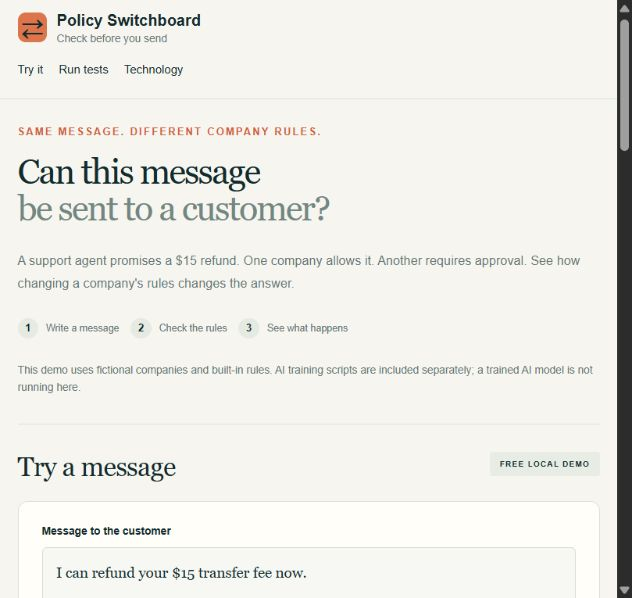
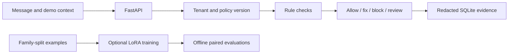

# Policy Switchboard

**Check whether a customer message follows the right company's rules—and whether it still does after those rules change.**

A support agent promises a $15 refund. Harbor used to allow refunds up to $20, but its new limit is $10. Cedar requires approval for every refund. This project makes those differences visible, testable and traceable.



## Current status

Working local prototype: FastAPI service, simple browser interface, company-specific rule checks, saved evidence, a 72-case synthetic test suite, selective evaluation and exact-configuration caching.

**No trained AI model is active.** LoRA training and offline model-evaluation scripts are included, but training has not run. The demo's result counts describe built-in rule checks, not AI accuracy or real-world compliance.

## Start the app

Python 3.11 or later:

```bash
python -m venv .venv
# Windows: .venv\Scripts\activate
# macOS/Linux: source .venv/bin/activate
python -m pip install -r requirements.lock.txt
python -m switchboard.launch
```

Open **http://127.0.0.1:8765**. API documentation is at **http://127.0.0.1:8765/docs**.

Windows users can launch `Start-PolicySwitchboard.cmd` after installing dependencies. A no-install fallback remains available through `python -m switchboard.server`.

## What you can try

1. Check the default $15 refund: previous Harbor rules allow it; new Harbor rules and Cedar require review.
2. Try a $5 refund: both Harbor versions still allow it.
3. Mark the refund as supervisor-approved: each company permits the supported refund commitment.
4. Try an investment guarantee: the supported simple claim is replaced with a checked statement.
5. Try private information: the message is blocked and credentials are hidden in stored evidence.
6. Run all examples, inspect each answer and download the JSON results.

## Technology

| Layer | Technology | Implemented status |
| --- | --- | --- |
| API | Python, FastAPI, Pydantic, Uvicorn | Installed, running and tested locally |
| Interface | HTML, CSS, JavaScript | Simple responsive page; no frontend build step |
| Enforcement | Versioned Python rules, decimal amounts, explicit handling priority | Narrow fictional support domain |
| Evidence | SQLite, policy hashes, tenant-scoped retrieval, secret redaction | Working local persistence |
| Evaluations | Python, paired version cases, dependency selection, exact-config cache | 72 full cases and 48 selective cases |
| ML workflow | PyTorch, Transformers, PEFT, TRL | Scripts included; ML dependencies/training not run here |
| Adaptation | LoRA, optional QLoRA, customer/version adapter registry | Optional GPU workflow; no saved trained adapters yet |
| Quality | unittest, API integration tests, GitHub Actions | 26 local tests passed; remote CI status is independent |
| Packaging | Docker and dependency lockfile | Dockerfile provided; container execution unverified |

This stack keeps the interface easy to run while putting the relevant ML work in Python. SQLite is appropriate for a local prototype; production deployment would need different authentication, trusted context retrieval, serving, storage and operations.

## How closely does it match ZeroDrift?

ZeroDrift publicly describes an enforcement model based on **Gemma E4B**, a deterministic rules engine, trained customer-policy LoRA adapters, and verified rewrites. Its hiring post requests post-training, efficient evaluations and deployment experience. [Published model description](https://zerodrift.com/model/anchor)

This project targets those responsibilities through customer-specific policies, policy-change tests, a LoRA pipeline and an API. **It does not contain ZeroDrift's proprietary Anchor model, and their exact internal libraries are not publicly confirmed by that description.** No particular base checkpoint has been downloaded or selected here. The training workflow requires a licensed instruction checkpoint compatible with its Transformers/TRL loading path; an E4B model with a different architecture may require loading changes.

See [the stack and alignment notes](docs/STACK.md) for confirmed facts, our choices and remaining work.

## Verify it

```bash
python -m unittest discover -s tests -v
python -m switchboard.evals --output artifacts/evaluation.json
python -m switchboard.evals --mode triage --output artifacts/triage.json
python -m ml.build_dataset
```

The curated smoke suite contains **72 fictional cases, 3 required-change pairs and 21 invariant pairs**. The deterministic baseline matches all 72. These tests were authored for this narrow prototype and are not an independent compliance benchmark. Selective evaluation covers 48 cases; a full suite still runs before a release. Dollar cost and GPU time are unmeasured.

## Optional ML experiment

The actual research question is whether customer-specific LoRA improves policy adherence over a prompted model, particularly when policy changes. Use `ml/train_lora.py` to train adapters, then `ml/evaluate_model.py` to compare the same base checkpoint with and without them. Training uses family-separated validation data and revision-pinned model identifiers; evaluation validates the adapter manifests.

[Full ML commands and limitations](RUN.md#optional-lora-workflow-not-executed-on-this-machine)

The generated training examples are small and unreviewed. The shared post-trained checkpoint, trained-model API backend, independent expert labels and model-vs-baseline results remain future work.

## Architecture



The UI sets approval and fee metadata only for this fictional demo. A real service must retrieve them from a trusted source. Messages requiring review or blocking are withheld. The local demo exposes its demo keys to its own interface and binds to loopback; it is not a public production service.

## Explore the repository

- [Run guide](RUN.md): installation, API calls and ML commands.
- [Demo walkthrough](DEMO.md): a three-minute explanation for an interview.
- [Research design](docs/DESIGN.md): the original experiment and intended deployment stages.
- [Technology alignment](docs/STACK.md): why each component is used.
- `switchboard/`: API, rules, benchmarks and caching.
- `ml/`: dataset generator, adapter training and offline inference/evaluation.
- `tests/`: rule and API tests.
- `.github/workflows/checks.yml`: Windows/Linux checks on Python 3.11 and 3.13.

This is an independent engineering portfolio project, not a ZeroDrift product or endorsement.
