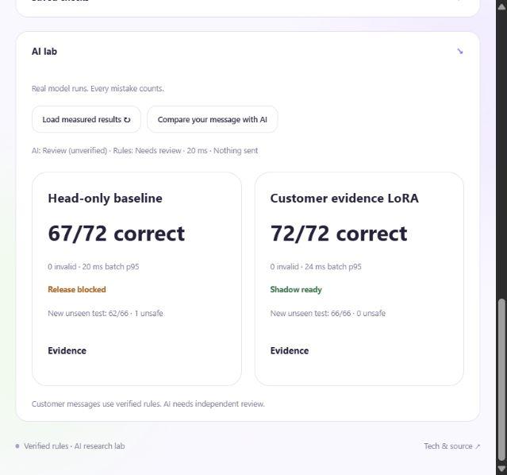
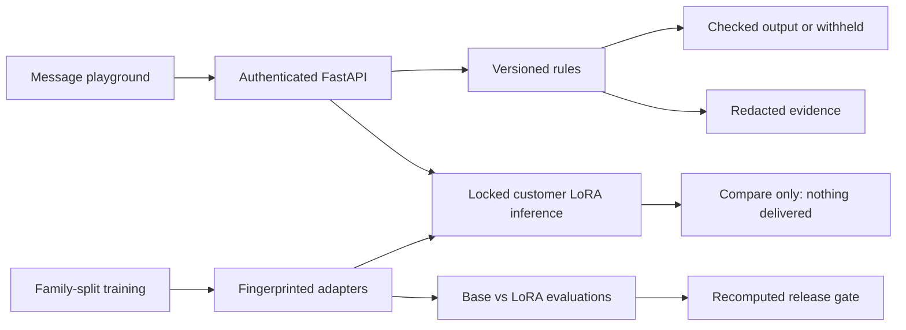

# Policy Switchboard

**What should change when a customer's policy changes—and what must stay correct?**

A $15 refund is allowed under Harbor's old $20 limit, held under its new $10 limit, and held under Cedar's approval policy. This application makes those differences playable, measurable and traceable.


## What is implemented

- A concise animated playground with allow, fix, block and review outcomes.
- Real customer/version LoRA training against an immutable open model checkpoint.
- Base-model versus adapter evaluation, raw outputs and a separate wording-family holdout.
- A release gate that rejects invalid answers, unsafe approvals, unnecessary holds, missing cases and policy regressions.
- Real local shadow inference with authenticated tenant routing, locked adapter switching and checked artifact fingerprints.
- Rules-based delivery, secret-redacted evidence, exact-configuration caching and selective evaluation.

The interactive lab now uses **MiniLM with three customer/version LoRA adapters and trained verdict heads**. Explicit approval and amount facts supplement semantic embeddings. AI comparisons never deliver customer text.

**Current measured result:** repaired LoRA 72/72 on the original checks, 66/66 on a newly frozen synthetic test, with zero unsafe approvals observed. A matched head-only control scores 67/72 and 62/66. The earlier challenge is now a development regression set after its failures informed coverage repairs. The gate permits shadow research only; customer model delivery remains disabled. See [architecture, company alignment and repaired mistakes](docs/ARCHITECTURE_AUDIT.md).

See [measured results](docs/MODEL_REPORT.md), [trust boundaries](docs/TRUST.md) and [the interview guide](docs/INTERVIEW.md).

**Recorded result:** base model 0/72 correct with 72 invalid outputs; customer adapters 25/72 correct with 47 unsafe allows. The adapter learned the output format but collapsed to allowing messages. The release gate rejected it. Verified rules continue to handle the playground; model-generated customer delivery stays disabled. This is a reproducible engineering experiment, not a successful production enforcement model.



## Start

```powershell
python -m venv .venv
.\.venv\Scripts\Activate.ps1
python -m pip install -r requirements.lock.txt
python -m switchboard.launch
```

Open **http://127.0.0.1:8765**. API documentation: **http://127.0.0.1:8765/docs**. The Windows launcher uses the installed project environment.

The rules playground works without ML packages. To reproduce the AI lab:

```powershell
python -m pip install torch==2.7.1 --index-url https://download.pytorch.org/whl/cu126
python -m pip install -r ml/requirements-tested.txt
python -c "from ml.checkpoints import download; download('sentence-transformers/all-MiniLM-L6-v2','1110a243fdf4706b3f48f1d95db1a4f5529b4d41')"
python -m ml.challenge
python -m ml.improve_fast
python -m ml.challenge_v2
python -m ml.repair_models
python -m ml.train_control_v6
```

Use a compatible PyTorch build for other hardware. Downloads stay in the project cache. No paid services or real customer data are used. GitHub contains source, manifests and measured reports; the local project bundle also contains adapter weights. Fresh clones can reproduce weights using the command above.

## Try it

1. Send the default $15 refund through three policy versions.
2. Try $5, change the amount or toggle supervisor approval.
3. Try a guarantee or private information.
4. Run 72 smoke checks or 48 policy-change checks.
5. Open **AI lab** for actual model results and compare your message with an adapter.

The approval toggle is fictional demo context. Production must retrieve approval and fee metadata from an authenticated support system.

## Technology

| Layer | Technology | Purpose |
| --- | --- | --- |
| API | Python, FastAPI, Pydantic, Uvicorn | Typed requests, tenant routing, OpenAPI |
| UI | HTML, CSS, JavaScript | Responsive animated playground without build tooling |
| Adaptation | PyTorch, Transformers, PEFT | Rank 8 encoder LoRA, customer verdict heads, unsafe-allow penalty |
| Current base | MiniLM-L6-v2, pinned commit | Bounded semantic classification and fast CPU serving |
| Evaluation | Counterfactual harness and frozen challenge | Raw decisions, policy changes, safety errors, calibration and ablation |
| Release checks | Canonical cases and SHA-256 identities | Fail closed on errors or changed artifacts |
| Evidence | SQLite and policy hashes | Tenant-scoped records with matched-secret redaction |
| Quality | unittest and GitHub Actions | Boundary, API, dataset and release-gate checks |

The recorded ML versions are pinned in [tested requirements](ml/requirements-tested.txt) and each training manifest. Linux Docker CI has verified the rules service and trusted-ticket boundary; trained-model container deployment is unverified. See [service checks](docs/SERVICE.md).

## Alignment with the role

The supplied hiring post asks for post-training, customer LoRA adapters, efficient evals and deployment. This project demonstrates actual small-model adaptation, measured comparisons, evaluation caching and a local model-serving boundary.

ZeroDrift publicly describes Gemma E4B, customer LoRA adapters, deterministic rules and verified rewrites. Its proprietary Anchor weights and exact internal library choices are not available here. This project targets the engineering responsibilities; it does not claim to reproduce Anchor. [First-party model description](https://zerodrift.com/model/anchor)

## Evaluation limits

The 72-case smoke suite includes 3 required-change pairs and 21 invariant pairs. Some schema seeds overlap training. The repaired run adds broader semantic coverage. A new 66-case synthetic test is frozen before retraining; the earlier challenge is explicitly a development regression set. Labels remain synthetic and unreviewed. Invalid JSON counts as wrong. Cached outputs are identified explicitly; uncached p95 excludes them. Dollar costs remain unknown.

Even a perfect synthetic gate permits shadow research only. Expert-reviewed representative data, rewrite review, adversarial testing and operational validation are prerequisites for customer deployment.

## Verify

```powershell
python -m unittest discover -s tests -v
python -m switchboard.evals --output artifacts/evaluation.json
python -m ml.summarize_experiment
```

## Architecture



This is a loopback-only fictional-data research application, with deliberately public demo keys. It is not a hosted production service or regulatory certification.

[Run guide](RUN.md) · [Demo walkthrough](DEMO.md) · [Model report](docs/MODEL_REPORT.md) · [Trust boundaries](docs/TRUST.md) · [Stack alignment](docs/STACK.md)
