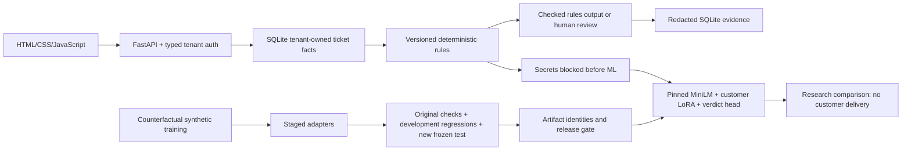

# Architecture and repaired mistakes

## ZeroDrift: confirmed public information

ZeroDrift describes its flagship Anchor as post-trained from **Gemma E4B**, with a **deterministic rules engine**, **customer-policy LoRA adapters**, identified passages and **verified rewrites**, serving in its cloud or a client VPC on **L40S**. Its Max variant is described as Qwen3.8-27B on H100 with uploaded policies. These are vendor descriptions, not independently verified internal implementation details. Their exact Python libraries, serving framework, database and frontend stack are not established by these pages. [Official model description](https://zerodrift.com/model/anchor) · [Public runtime flow](https://zerodrift.com/platform/overview).

## This project: implemented architecture



| Layer | Implemented technology and purpose |
| --- | --- |
| Model | Pinned MiniLM-L6-v2 semantic encoder; normalized masked embeddings plus six explicit business facts |
| Adaptation | PyTorch 2.7.1, Transformers 4.57.6, PEFT 0.21.2; rank 8 query/value LoRA and separate customer verdict heads |
| Training | CUDA on the local GTX 1650 Ti, 45 epochs, validation-selected checkpoints, unsafe-allow penalty |
| Serving | CPU PyTorch, local-only pinned checkpoint, FastAPI/Pydantic/Uvicorn, checked safetensors and manifest refresh |
| Context/evidence | Tenant-scoped SQLite tickets, typed approval facts, redacted audit records and policy hashes |
| Evaluation | Canonical case identities, raw predictions, safety errors, policy-change pairs, ECE/Brier and matched head-only controls |
| Deployment | Docker CPU model target and GitHub Actions Linux/Windows checks; offline shadow inference in a clean container |
| Interface | Small animated HTML/CSS/JavaScript playground with no build dependency |

The structural facts are computed outside the neural model. This is a hybrid classifier, not a model that learned decimal arithmetic or a replica of Anchor. Model-based rewrite generation is not implemented. Historical TRL causal-model experiments remain in the repository but are not the active serving path. vLLM and ONNX serving are not claimed as executed.

## Mistakes found and repairs

| Mistake | Repair and verification |
| --- | --- |
| Amount-less refund approved; refusal/guarantee paraphrases misclassified | Added broad missing-amount, refusal, neutral-message and guarantee families; retrained three staged adapters; kept benchmark text unchanged |
| Old challenge was no longer truly unseen after inspecting its errors | Reclassified it as a development regression set; froze a new 66-case test before retraining; no exact test messages appear in training |
| UI trusted saved `correct`/`total` summaries | Recompute displayed counts from canonical raw predictions; test inflates summaries to 999 and verifies the UI receives the actual 71/72 result |
| Retraining overwrote active weights before evaluation | Train separate candidates, evaluate first, archive identities, check nonregression, then activate; rollback test interrupts the second customer and restores both old adapters |
| Wrong dataset could be passed to the evaluator | Verify supplied training/validation hashes against each adapter manifest before evaluation |
| Invalid model paths or policies reached resource loading | Validate known policy and experiment names first; invalid shadow version returns 400 |
| Corrupt reports surfaced an uncontrolled server error | Return 503 and withhold release approval; API regression test covers corruption |
| Old privacy test exercised an archived runtime | Added a test for the current runtime proving secrets never reach the classifier |
| Zero/negative training budgets or nonfinite penalties were accepted | Reject invalid arguments before loading the model |

## Current measured results

| Experiment | Original 72 cases | Earlier 66-case development set | New frozen 66-case test | Unsafe approvals on new test |
| --- | --- | --- | --- | --- |
| Matched frozen-encoder/head-only control | 67/72 | 57/66 | 62/66 | 1 |
| Repaired customer LoRA | **72/72** | **66/66** | **66/66** | **0** |

All three required policy-change pairs are correct. Monitored validation is 816/816; it was used for checkpoint selection and is not blind evidence. The previous v5 model scored 70/72 and 59/66 before these repairs. The original challenge's new score is a development regression result, not an unseen-test improvement claim. The new test was authored and frozen before v6 training and was not used for epoch selection or subsequent tuning.

The synthetic gate now permits **shadow research only**. Perfect scores on a small synthetic set do not establish production regulatory reliability, independent expert review or equivalence to ZeroDrift's human-labeled benchmark. Customer model delivery stays disabled; representative expert-reviewed data and real-client deployment remain outstanding.

## Reproduce the repaired study

```powershell
python -c "from ml.checkpoints import download; download('sentence-transformers/all-MiniLM-L6-v2','1110a243fdf4706b3f48f1d95db1a4f5529b4d41')"
python -m ml.challenge
python -m ml.challenge_v2
python -m ml.repair_models
python -m ml.train_control_v6
python -m unittest discover -s tests -v
```

Start with the project's tested ML dependencies and a compatible PyTorch build. The provided local bundle includes active weights; the GitHub source can reproduce them. If an active adapter is absent, reproduce the historical v5 baseline with `python -m ml.improve_fast` before running the candidate repair pipeline. Model-serving CI builds its own v6 Harbor v2 adapter directly from source. It does not publish trained weights to the repository.
